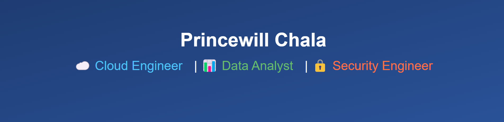

 
> *"ETHICAL HACKING | CLOUD | DATA. --Breaking systems is easy. Building them to last is power"*

## Skills

- **Cloud Computing -> AWS** : To design, deploy, and manage scalable and secure applications in the cloud.
- **Cybersecurity & Networking** : To understand, secure, and test systems and networks from both a defensive and offensive perspective.
- **Data Analytics** : To extract, clean, analyze, and visualize data for insights that drive smarter decision-making.
- **Web Development** : To build responsive, user-friendly, and interactive web applications.

## Tools
  **🛡️ Cybersecurity & Networking**

   &nbsp;&nbsp;&nbsp;&nbsp;    &nbsp;&nbsp;&nbsp;&nbsp;      &nbsp;&nbsp;&nbsp;&nbsp;     &nbsp;&nbsp;&nbsp;&nbsp;     

---

 **📊 Data & Analytics**
 
 &nbsp;&nbsp;&nbsp;&nbsp;
 &nbsp;&nbsp;&nbsp;&nbsp;
 &nbsp;&nbsp;&nbsp;&nbsp;
  

---
  **☁️ Cloud**
  
 &nbsp;&nbsp;&nbsp;&nbsp;
  

---

  **💻 Web Development**
  
  &nbsp;&nbsp;&nbsp;&nbsp;
  &nbsp;&nbsp;&nbsp;&nbsp;
  

---

### 🌐 Find me 
🔗 [Portfolio](https://www.elochukwuprincewill.com) &nbsp;&nbsp;&nbsp;&nbsp;
💼 [LinkedIn](https://www.linkedin.com/in/elochukwu-princewill) &nbsp;&nbsp;&nbsp;&nbsp;
🐦 [Twitter](https://x.com/Chala_lokal) &nbsp;&nbsp;&nbsp;&nbsp;
💻 [GitHub](https://www.github.com/Princewill-chala)

> *"Tech is my canvas. I build, secure, and visualize the future."*
<!---
Princewill-chala/Princewill-chala is a ✨ special ✨ repository because its `README.md` (this file) appears on your GitHub profile.
You can click the Preview link to take a look at your changes.
--->
